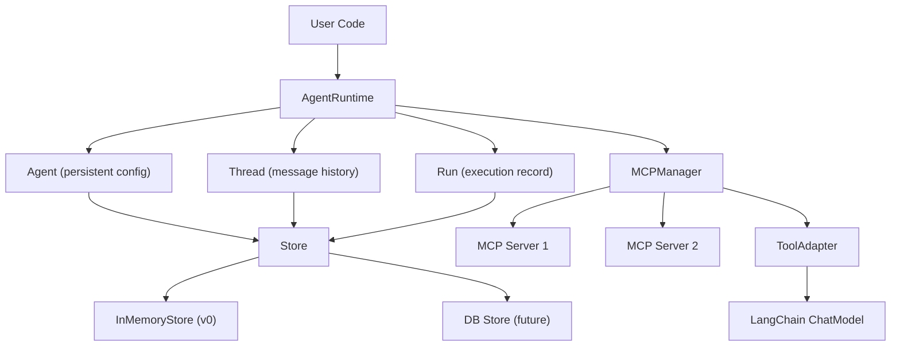

# Agent SDK/Runtime Architecture (v0)

## Guiding Principles

1. **Agent / Thread / Run** -- three separate entities, clear responsibilities
2. **LangChain core** for model-agnostic messages and tool binding (not the full framework)
3. **MCP as the tool standard** -- tools come from MCP servers
4. **Persistence-ready** -- in-memory dicts for v0, but every entity is serializable and keyed by UUID
5. **Simple over clever** -- no premature abstractions, but the data model is right from day 1

## Architecture Overview



## Core Entities (the data model)

This is the key insight: separate **config** from **conversation** from **execution**.

### 1. `Agent` -- persistent configuration (created once, reused)

Like an OpenAI Assistant. The consumer creates this once, persists it, comes back to it.

- `id: str` -- UUID, primary key
- `name: str` -- human-readable name
- `model: str` -- e.g. `"gpt-4o"`
- `provider: Literal["openai", "anthropic"]`
- `system_prompt: str`
- `mcp_servers: list[MCPServerConfig]` -- all available MCP servers for this agent
- `max_iterations: int = 10`
- `temperature: float = 0`
- `api_key: str | None` -- falls back to env var
- `created_at: datetime`
- `updated_at: datetime`

**v0**: All MCP servers on the agent are enabled. To "disable" one, create a different Agent.

**Future**: Add `enabled_servers: list[str] | None` field on Run for per-run overrides.

### 2. `Thread` -- message history (a conversation)

Just a container for messages. Can be resumed by starting a new Run on the same Thread.

- `id: str` -- UUID
- `agent_id: str` -- which Agent this Thread belongs to
- `messages: list[BaseMessage]` -- LangChain messages (HumanMessage, AIMessage, ToolMessage)
- `metadata: dict` -- open-ended context (e.g. user info, session tags)
- `created_at: datetime`
- `updated_at: datetime`

**Why separate from Run**: A Thread can have multiple Runs (user sends a message, gets a response, sends another -- each is a Run). Messages accumulate on the Thread across Runs.

**Future**: Forking = copy a Thread's messages into a new Thread. Trivial with this model.

### 3. `Run` -- one execution of the agentic loop

Created each time `.run()` is called. Records what happened during that invocation.

- `id: str` -- UUID
- `thread_id: str` -- which Thread this Run operates on
- `agent_id: str` -- which Agent config was used
- `status: Literal["queued", "running", "completed", "failed", "cancelled"]`
- `started_at: datetime`
- `completed_at: datetime | None`
- `iterations: int` -- how many loop steps it took
- `stop_reason: Literal["end_turn", "max_iterations", "error"] | None`
- `error: str | None` -- if it failed
- `mcp_servers_used: list[str] | None` -- which servers were active (v0: all from Agent)
- `context: dict` -- run-specific params or overrides (extensible for future)

**Why this exists**: Separates execution metadata from the conversation. You can see "this thread had 5 runs, run #3 failed, run #4 succeeded." Useful for debugging, billing, observability.

### 4. `MCPServerConfig` (pydantic, embedded in Agent)

- `name: str` -- identifier
- `transport: Literal["stdio", "sse"]`
- `command: str | None` -- for stdio (e.g. `"uvx"`)
- `args: list[str]` -- for stdio (e.g. `["mcp-server-weather"]`)
- `url: str | None` -- for SSE transport
- `env: dict[str, str]` -- env vars passed to the server process
- `enabled: bool = True` -- v0: always True, but the field exists

## Supporting Classes

### `MCPManager` (MCP connection lifecycle)

- Takes a list of `MCPServerConfig`
- `connect_all()` -- starts MCP servers, creates `ClientSession` objects
- `get_tools() -> list[Tool]` -- aggregates tools from all connected servers
- `call_tool(tool_name, args) -> result` -- routes tool call to the correct server
- `disconnect_all()` -- cleanup
- Uses the `mcp` Python SDK (`ClientSession`, `StdioServerParameters`, etc.)

### `ToolAdapter` (MCP tools to LangChain tools)

- Converts MCP tool schemas to LangChain-compatible tool definitions
- Each converted tool is a callable that routes through `MCPManager.call_tool()`
- This is what gets passed to `ChatModel.bind_tools()`

### `AgentRuntime` (the orchestrator)

- `__init__(store: Store)` -- just needs a store
- `create_agent(name, model, ...) -> Agent` -- create and persist an Agent config
- `create_thread(agent_id) -> Thread` -- start a new conversation
- `run(thread_id, user_message) -> RunResult` -- the agentic loop (creates a Run internally)

### `StepResult` / `RunResult`

- `StepResult`: one iteration (model response, tool calls made, tool results)
- `RunResult`: final output text, run_id, thread_id, number of iterations, stop reason

## The Agentic Loop

```
def run(thread_id: str, user_message: str) -> RunResult:
    thread = store.get_thread(thread_id)
    agent = store.get_agent(thread.agent_id)

    # Create a Run record
    run = Run(thread_id=thread.id, agent_id=agent.id, status="running")
    store.save_run(run)

    # Append user message to thread
    thread.messages.append(HumanMessage(content=user_message))

    # Connect to MCP servers, discover tools
    mcp_servers = [s for s in agent.mcp_servers if s.enabled]
    mcp_manager = MCPManager(mcp_servers)
    mcp_manager.connect_all()
    tools = tool_adapter.convert(mcp_manager.get_tools())
    model = create_chat_model(agent).bind_tools(tools)

    for i in range(agent.max_iterations):
        response: AIMessage = model.invoke(
            [SystemMessage(content=agent.system_prompt)] + thread.messages
        )
        thread.messages.append(response)

        if not response.tool_calls:
            run.stop_reason = "end_turn"
            break

        for tool_call in response.tool_calls:
            result = mcp_manager.call_tool(tool_call["name"], tool_call["args"])
            thread.messages.append(ToolMessage(
                content=str(result), tool_call_id=tool_call["id"]
            ))
    else:
        run.stop_reason = "max_iterations"

    # Finalize
    run.status = "completed"
    run.iterations = i + 1
    run.completed_at = now()
    store.save_thread(thread)
    store.save_run(run)
    mcp_manager.disconnect_all()
    return RunResult(output=response.content, run=run)
```

## Store (persistence abstraction)

A single `Store` protocol that manages all three entities:

```
class Store(Protocol):
    # Agent CRUD
    def save_agent(agent: Agent) -> None
    def get_agent(agent_id: str) -> Agent
    def list_agents() -> list[Agent]
    def delete_agent(agent_id: str) -> None

    # Thread CRUD
    def save_thread(thread: Thread) -> None
    def get_thread(thread_id: str) -> Thread
    def list_threads(agent_id: str) -> list[Thread]
    def delete_thread(thread_id: str) -> None

    # Run CRUD
    def save_run(run: Run) -> None
    def get_run(run_id: str) -> Run
    def list_runs(thread_id: str) -> list[Run]
```

`InMemoryStore`: three dicts keyed by id. Later, swap for `PrismaStore` or `PostgresStore`.

## What v0 Implements vs Designs For

| Feature | v0 (implement) | Future (data model ready) |

|---|---|---|

| Agent CRUD | Yes | -- |

| Thread create/resume | Yes | -- |

| Run creation + tracking | Yes | -- |

| MCP server connect + tool discovery | Yes | -- |

| Agentic loop | Yes | -- |

| In-memory store | Yes | -- |

| MCP enable/disable per agent | `enabled` field exists, always True | Per-run server overrides |

| Thread forking | -- | Copy messages to new Thread |

| DB persistence | -- | Swap InMemoryStore for DB store |

| Multiple model providers | OpenAI only | Change import to ChatAnthropic |

| Run cancellation | -- | Set status to cancelled |

| Streaming | -- | Use `.astream()` instead of `.invoke()` |

## Project Structure

```
mcp-sharepoint/
  pyproject.toml              # updated with deps
  agent_runtime/
    __init__.py               # public API exports
    config.py                 # MCPServerConfig
    entities.py               # Agent, Thread, Run (the data model)
    store.py                  # Store protocol + InMemoryStore
    mcp_manager.py            # MCP connection lifecycle
    tool_adapter.py           # MCP tool -> LangChain tool converter
    runtime.py                # AgentRuntime (orchestrator + agentic loop)
    models.py                 # StepResult, RunResult
  examples/
    basic_agent.py            # simple usage example
  main.py                     # updated entrypoint
```

## Dependencies

```
langchain-core        # message types, chat model interface, tool abstractions
langchain-openai      # ChatOpenAI (starting provider)
mcp                   # MCP Python SDK for client connections
pydantic              # data models
```

## Usage Example

```python
from agent_runtime import AgentRuntime, MCPServerConfig, InMemoryStore

store = InMemoryStore()
runtime = AgentRuntime(store=store)

# Create an agent once, persist it
agent = runtime.create_agent(
    name="weather-bot",
    model="gpt-4o",
    system_prompt="You are a helpful weather assistant.",
    mcp_servers=[
        MCPServerConfig(name="weather", transport="stdio",
                        command="uvx", args=["mcp-server-weather"]),
    ],
)

# Start a conversation (creates a Thread)
thread = runtime.create_thread(agent_id=agent.id)

# Run the agent (creates a Run, executes the loop)
result = runtime.run(thread_id=thread.id, user_message="Weather in SF?")
print(result.output)

# Resume the same conversation later
result2 = runtime.run(thread_id=thread.id, user_message="What about NYC?")
```